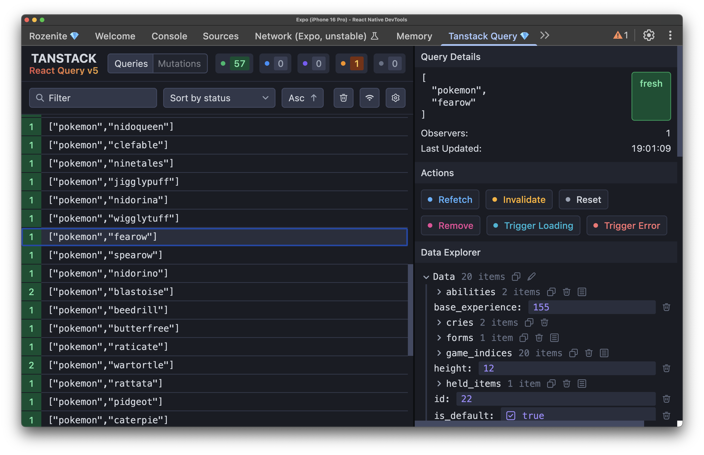

# Dev Tools
## Debugging using developer tools

---

## `npm run start`
## Or press `?`

---

## Press `m` to open dev menu

---

## Useful tools

- __Performance monitor__
  - FPS check
  - Thread inspection
- __Element inspector__
  - Layering check
  - Offset/sizes check

---

## Press `j` to open Chrome Dev Tools

---

---

# Rozenite
## Extra Dev plugins

[rozenite.dev](https://www.rozenite.dev/docs/introduction)

---

---

# Proxyman
## Network traffic inspector

[proxyman.io](https://proxyman.io)

---

