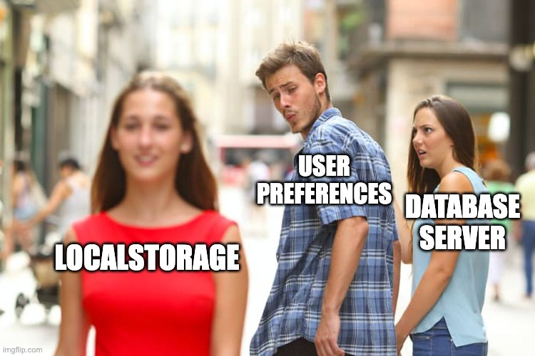

# Local Storage
## Saving data to user's device

---

# When to use local storage?

- No syncing with server needed:
    - Device / user preferences
    - Auth tokens storage
    - Tracking of actions



---

# Types of local storage

- Shared Preferences / User Defaults
- Keychain
- File System
- SQLite

---

# Shared Preferences / User Defaults

- Key-value storage
- Built-in Android/iOS
- Not secure
- Not scalable

## Example: Simple Settings
```typescript
// Store user theme preference
await AsyncStorage.setItem('theme', 'dark');
const theme = await AsyncStorage.getItem('theme');
```

---

# Keychain

- Secure storage
- Built-in Android/iOS
- Secure
- Scalable

## Example: Secure Token Storage
```typescript
// Store authentication token securely
await SecureStore.setItemAsync('authToken', 'jwt_token_here');
const token = await SecureStore.getItemAsync('authToken');
```

---

# File System

- File storage
- Built-in Android/iOS
- Not secure
- Not scalable

## Example: Cache Images
```typescript
// Save downloaded Pokemon image to file system
const fileUri = FileSystem.documentDirectory + 'pokemon_25.jpg';
await FileSystem.writeAsStringAsync(fileUri, imageData, {
  encoding: FileSystem.EncodingType.Base64
});
```

---

# SQLite

- Relational database
- Built-in Android/iOS
- Secure
- Scalable

## Example: Pokemon Favorites Database
```typescript
// Initialize database and create tables
await databaseService.initDatabase();

// Add favorite Pokemon
await databaseService.addFavorite(25, "pikachu", "image_url");

// Check if Pokemon is favorite
const isFavorite = await databaseService.isFavorite(25);

// Get all favorites
const favorites = await databaseService.getAllFavorites();
```

---

# What to use to save favorites?

a) File System
b) Keychain
c) Shared Preferences / User Defaults
d) SQLite

---

# What to use to save favorites?

a) File System
b) Keychain
c) Shared Preferences / User Defaults 🤷
d) SQLite 👈


---

# `npm install expo-sqlite`

## Example: Database Service Setup
```typescript
import * as SQLite from "expo-sqlite";

class DatabaseService {
  private db: SQLite.SQLiteDatabase | null = null;
  
  async initDatabase(): Promise<void> {
    this.db = await SQLite.openDatabaseAsync("pokedex.db");
    await this.createTables();
  }
}
```

---

## Example: Create Tables

```typescript
await this.db.execAsync(`
  CREATE TABLE IF NOT EXISTS favorites (
    id INTEGER PRIMARY KEY,
    name TEXT NOT NULL,
    image_url TEXT,
    created_at DATETIME DEFAULT CURRENT_TIMESTAMP
  );
`);
```

---

## Example: Add Favorite

```typescript
try {
  await this.db.runAsync(
    "INSERT OR REPLACE INTO favorites (id, name, image_url) VALUES (?, ?, ?)",
    [pokemonId, name, imageUrl || ""]
  );
} catch (error) {
  console.error("Error adding favorite:", error);
  throw error;
}
```

## Example: Is Favorited?

```typescript
const result = await this.db.getFirstAsync<{ count: number }>(
  "SELECT COUNT(*) as count FROM favorites WHERE id = ?",
  [pokemonId]
);
return (result?.count || 0) > 0;
```

## Example: Remove Favorite

```typescript
try {
  await this.db.runAsync("DELETE FROM favorites WHERE id = ?", [pokemonId]);
} catch (error) {
  console.error("Error removing favorite:", error);
  throw error;
}
```

## Example: Get all favorites

```typescript
try {
  const result = await this.db.getAllAsync<FavoritePokemon>(
    "SELECT * FROM favorites ORDER BY created_at DESC"
  );
  return result;
} catch (error) {
  console.error("Error getting favorites:", error);
  return [];
}
```
