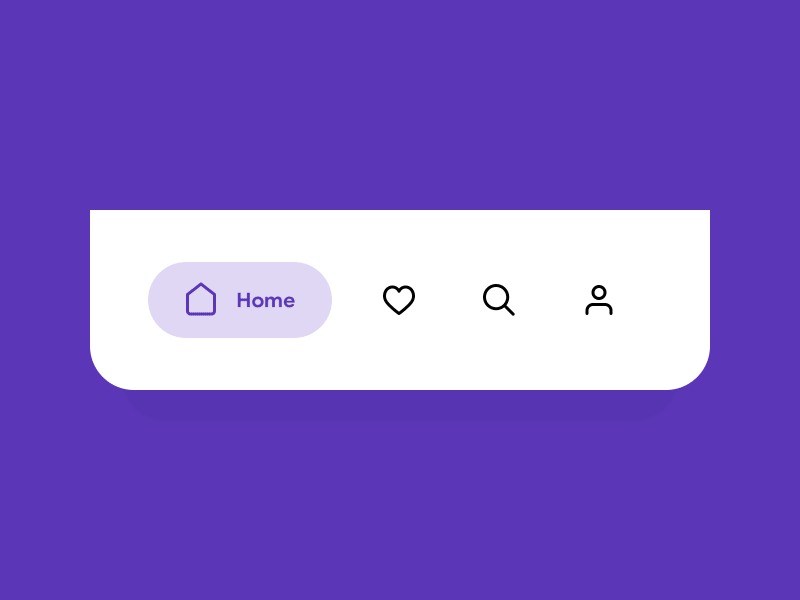
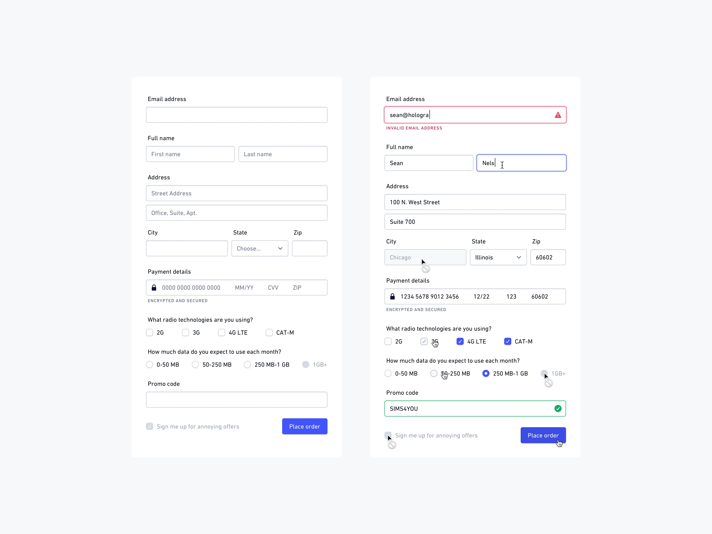
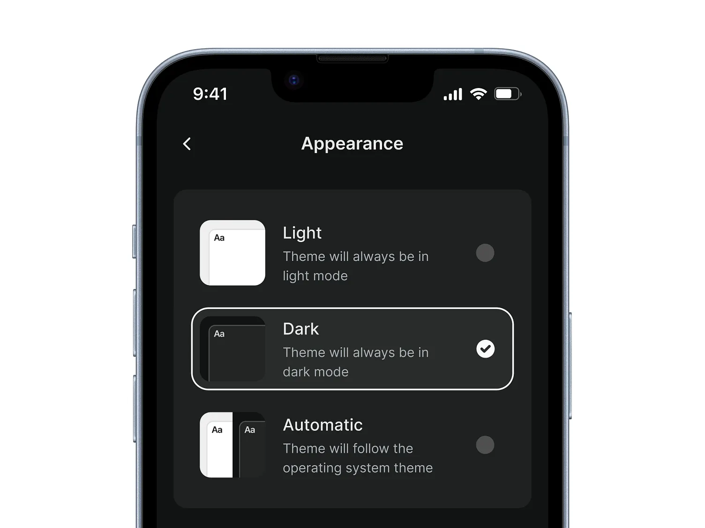
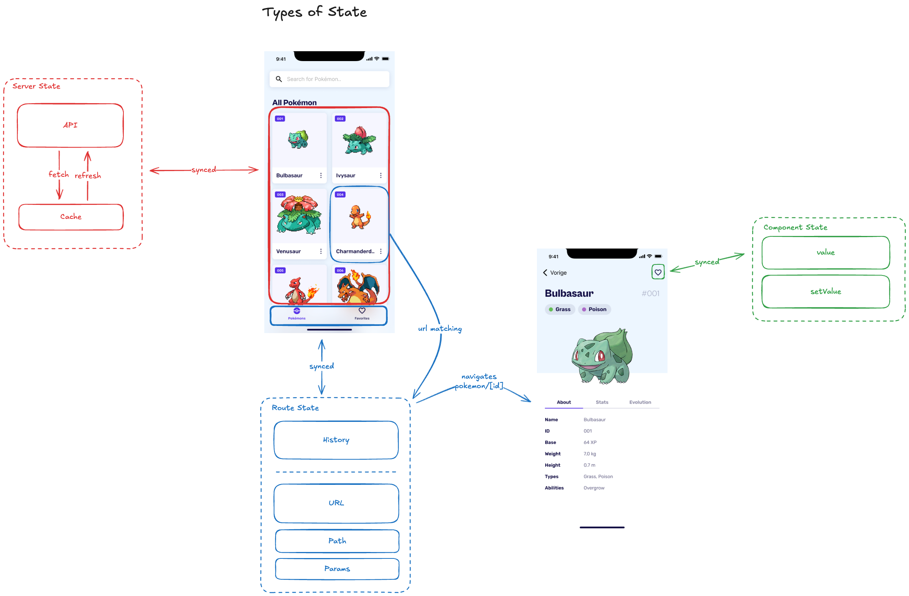

# State Management
## Different Types of State

---

# 1. Server State
## Data from APIs and External Sources

**Characteristics:** Asynchronous • Can be stale • Needs caching • Requires error handling


---

# 1. Server State - Example

```typescript
import { useQuery } from '@tanstack/react-query';

const UserList = () => {
  const { data: users, isLoading, error } = useQuery({
    queryKey: ['users'],
    queryFn: () => fetch('/api/users').then(res => res.json()),
    staleTime: 5 * 60 * 1000, // 5 minutes
    refetchOnWindowFocus: false,
  });

  if (isLoading) return <Text>Loading...</Text>;
  if (error) return <Text>Error: {error.message}</Text>;

  return (
    <View>
      {users?.map(user => <Text key={user.id}>{user.name}</Text>)}
    </View>
  );
};
```

**Characteristics:** Asynchronous • Can be stale • Needs caching • Requires error handling

---

# 2. URL State
## Navigation and Routing State



**Characteristics:** Persists across refreshes • URLs are unique • Deep linking • History tracking

---

# 2. URL State - Example

```typescript
import { useLocalSearchParams, useRouter } from 'expo-router';

const UserProfile = () => {
  const { userId, tab } = useLocalSearchParams<{
    userId: string;
    tab: 'posts' | 'comments' | 'likes';
  }>();
  
  const router = useRouter();
  
  const navigateToUser = (newUserId: string) => {
    router.push(`/users/${newUserId}?tab=${tab}`);
  };
  
  const switchTab = (newTab: string) => {
    router.setParams({ tab: newTab });
  };

  return (
    <View>
      <Text>User ID: {userId}</Text>
      <Text>Active Tab: {tab}</Text>
      <Button title="Switch to Posts" onPress={() => switchTab('posts')} />
    </View>
  );
};
```

**Characteristics:** Persists across refreshes • Shareable via URL • Browser history integration • SEO friendly

---

# 3. Form State
## User Input and Validation

**Characteristics:** User input focused • Validation required • Dirty/touched tracking • Submission handling



---

# 3. Form State - Example

```typescript

import { useForm } from 'react-hook-form';

const LoginForm = () => {
  const { register, handleSubmit, formState: { errors } } = useForm();
  
  const onSubmit = (data) => {
    console.log(data); // { email: 'user@example.com', password: 'password' }
  };

  return (
    <form onSubmit={handleSubmit(onSubmit)}>
      <input 
        {...register('email', { required: 'Email is required' })}
        placeholder="Email"
      />
      {errors.email && <span>{errors.email.message}</span>}
      
      <input 
        {...register('password', { minLength: 6 })}
        type="password"
        placeholder="Password"
      />
      {errors.password && <span>Password must be 6+ characters</span>}
      
      <button type="submit">Login</button>
    </form>
  );
};
```

---

# 4. Component State
## Local Component State


**Characteristics:** Component-scoped • UI-specific • Short-lived • Performance optimized

---

# 4. Component State - Example

```typescript
const [isToggled, setIsToggled] = useState(false);

const toggleToggled = () => setIsToggled(prev => !prev);

return (
  <View>
    <Button onPress={toggleToggled}>Toggle</Button>
    {isToggled && <Text>Toggled</Text>}
  </View>
);
```

---

# 5. Global State
## Application-wide State



**Characteristics:** Shared across components • Long-lived • Centralized • Performance considerations

---

# 5. Global State
## Application-wide State

```typescript
const AppContext = createContext<{
  user: User | null;
  setUser: (user: User | null) => void;
  notifications: Notification[];
  addNotification: (notification: Notification) => void;
}>();

export const AppProvider = ({ children }: { children: ReactNode }) => {
  const [user, setUser] = useState<User | null>(null);
  const [notifications, setNotifications] = useState<Notification[]>([]);
  
  const addNotification = (notification: Notification) => {
    setNotifications(prev => [...prev, notification]);
  };

  return (
    <AppContext.Provider value={{ user, setUser, notifications, addNotification }}>
      {children}
    </AppContext.Provider>
  );
};
```

---

# Types of State Applied

https://link.excalidraw.com/readonly/PRMGp56Awzo1k0jFFsoZ



---

# SQLite CRUD Examples
## Create, Read, Update, Delete Operations

---

# Creating Entries (INSERT)

```typescript
// Add a new Pokemon to favorites
async addFavorite(
  pokemonId: number,
  name: string,
  imageUrl?: string
): Promise<void> {
  if (!this.db) throw new Error("Database not initialized");

  try {
    await this.db.runAsync(
      "INSERT OR REPLACE INTO favorites (id, name, image_url) VALUES (?, ?, ?)",
      [pokemonId, name, imageUrl || ""]
    );
  } catch (error) {
    console.error("Error adding favorite:", error);
    throw error;
  }
}

// Usage
await databaseService.addFavorite(25, "pikachu", "https://raw.githubusercontent.com/PokeAPI/sprites/master/sprites/pokemon/25.png");
```

---

# Reading Entries (SELECT)

```typescript
// Get all favorites
async getAllFavorites(): Promise<FavoritePokemon[]> {
  if (!this.db) throw new Error("Database not initialized");

  try {
    const result = await this.db.getAllAsync<FavoritePokemon>(
      "SELECT * FROM favorites ORDER BY created_at DESC"
    );
    return result;
  } catch (error) {
    console.error("Error getting favorites:", error);
    return [];
  }
}

// Check if Pokemon is favorite
async isFavorite(pokemonId: number): Promise<boolean> {
  if (!this.db) throw new Error("Database not initialized");

  try {
    const result = await this.db.getFirstAsync<{ count: number }>(
      "SELECT COUNT(*) as count FROM favorites WHERE id = ?",
      [pokemonId]
    );
    return (result?.count || 0) > 0;
  } catch (error) {
    console.error("Error checking favorite status:", error);
    return false;
  }
}

// Usage
const favorites = await databaseService.getAllFavorites();
const isPikachuFavorite = await databaseService.isFavorite(25);
```

---

# Removing Entries (DELETE)

```typescript
// Remove Pokemon from favorites
async removeFavorite(pokemonId: number): Promise<void> {
  if (!this.db) throw new Error("Database not initialized");

  try {
    await this.db.runAsync("DELETE FROM favorites WHERE id = ?", [pokemonId]);
  } catch (error) {
    console.error("Error removing favorite:", error);
    throw error;
  }
}

// Usage
await databaseService.removeFavorite(25);
```

---

# Complete Database Service Example

```typescript
import * as SQLite from "expo-sqlite";

export interface FavoritePokemon {
  id: number;
  name: string;
  image_url: string;
  created_at: string;
}

class DatabaseService {
  private db: SQLite.SQLiteDatabase | null = null;

  async initDatabase(): Promise<void> {
    try {
      this.db = await SQLite.openDatabaseAsync("pokedex.db");
      await this.createTables();
    } catch (error) {
      console.error("Error initializing database:", error);
      throw error;
    }
  }

  private async createTables(): Promise<void> {
    if (!this.db) throw new Error("Database not initialized");

    await this.db.execAsync(`
      CREATE TABLE IF NOT EXISTS favorites (
        id INTEGER PRIMARY KEY,
        name TEXT NOT NULL,
        image_url TEXT,
        created_at DATETIME DEFAULT CURRENT_TIMESTAMP
      );
    `);
  }

  // CRUD methods here...
}

export const databaseService = new DatabaseService();
```


