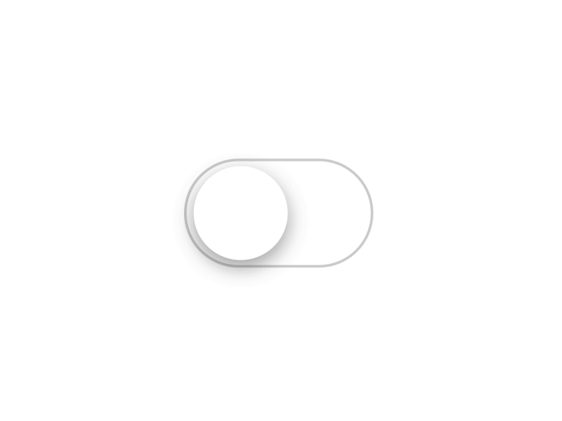

# State Management
## Different Types of State

---

# 1. Server State
## Data from APIs and External Sources

**Characteristics:** Asynchronous • Can be stale • Needs caching • Requires error handling


---

# 1. Server State - Example

```typescript
import { useQuery } from '@tanstack/react-query';

const UserList = () => {
  const { data: users, isLoading, error } = useQuery({
    queryKey: ['users'],
    queryFn: () => fetch('/api/users').then(res => res.json()),
    staleTime: 5 * 60 * 1000, // 5 minutes
    refetchOnWindowFocus: false,
  });

  if (isLoading) return <Text>Loading...</Text>;
  if (error) return <Text>Error: {error.message}</Text>;

  return (
    <View>
      {users?.map(user => <Text key={user.id}>{user.name}</Text>)}
    </View>
  );
};
```

**Characteristics:** Asynchronous • Can be stale • Needs caching • Requires error handling

---

# 2. URL State
## Navigation and Routing State


**Characteristics:** Persists across refreshes • URLs are unique • Deep linking • History tracking

---

# 2. URL State - Example

```typescript
import { useLocalSearchParams, useRouter } from 'expo-router';

const UserProfile = () => {
  const { userId, tab } = useLocalSearchParams<{
    userId: string;
    tab: 'posts' | 'comments' | 'likes';
  }>();
  
  const router = useRouter();
  
  const navigateToUser = (newUserId: string) => {
    router.push(`/users/${newUserId}?tab=${tab}`);
  };
  
  const switchTab = (newTab: string) => {
    router.setParams({ tab: newTab });
  };

  return (
    <View>
      <Text>User ID: {userId}</Text>
      <Text>Active Tab: {tab}</Text>
      <Button title="Switch to Posts" onPress={() => switchTab('posts')} />
    </View>
  );
};
```

**Characteristics:** Persists across refreshes • Shareable via URL • Browser history integration • SEO friendly

---

# 3. Form State
## User Input and Validation

**Characteristics:** User input focused • Validation required • Dirty/touched tracking • Submission handling


---

# 3. Form State - Example

```typescript

import { useForm } from 'react-hook-form';

const LoginForm = () => {
  const { register, handleSubmit, formState: { errors } } = useForm();
  
  const onSubmit = (data) => {
    console.log(data); // { email: 'user@example.com', password: 'password' }
  };

  return (
    <form onSubmit={handleSubmit(onSubmit)}>
      <input 
        {...register('email', { required: 'Email is required' })}
        placeholder="Email"
      />
      {errors.email && <span>{errors.email.message}</span>}
      
      <input 
        {...register('password', { minLength: 6 })}
        type="password"
        placeholder="Password"
      />
      {errors.password && <span>Password must be 6+ characters</span>}
      
      <button type="submit">Login</button>
    </form>
  );
};
```

---

# 4. Component State
## Local Component State



**Characteristics:** Component-scoped • UI-specific • Short-lived • Performance optimized

---

# 4. Component State - Example

```typescript
const [isToggled, setIsToggled] = useState(false);

const toggleToggled = () => setIsToggled(prev => !prev);

return (
  <View>
    <Button onPress={toggleToggled}>Toggle</Button>
    {isToggled && <Text>Toggled</Text>}
  </View>
);
```

---

# 5. Global State
## Application-wide State


**Characteristics:** Shared across components • Long-lived • Centralized • Performance considerations

---

# 5. Global State
## Application-wide State

```typescript
const AppContext = createContext<{
  user: User | null;
  setUser: (user: User | null) => void;
  notifications: Notification[];
  addNotification: (notification: Notification) => void;
}>();

export const AppProvider = ({ children }: { children: ReactNode }) => {
  const [user, setUser] = useState<User | null>(null);
  const [notifications, setNotifications] = useState<Notification[]>([]);
  
  const addNotification = (notification: Notification) => {
    setNotifications(prev => [...prev, notification]);
  };

  return (
    <AppContext.Provider value={{ user, setUser, notifications, addNotification }}>
      {children}
    </AppContext.Provider>
  );
};
```

---

# Types of State Applied

https://link.excalidraw.com/readonly/PRMGp56Awzo1k0jFFsoZ


