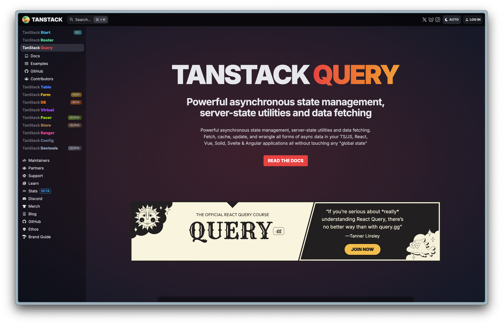
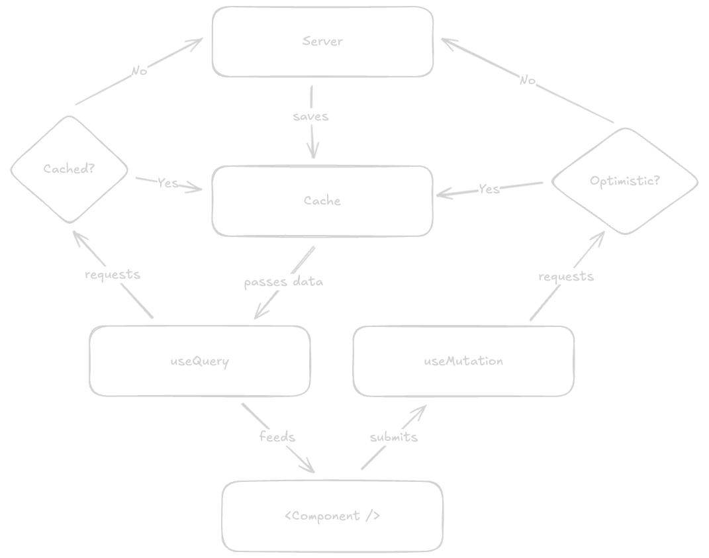
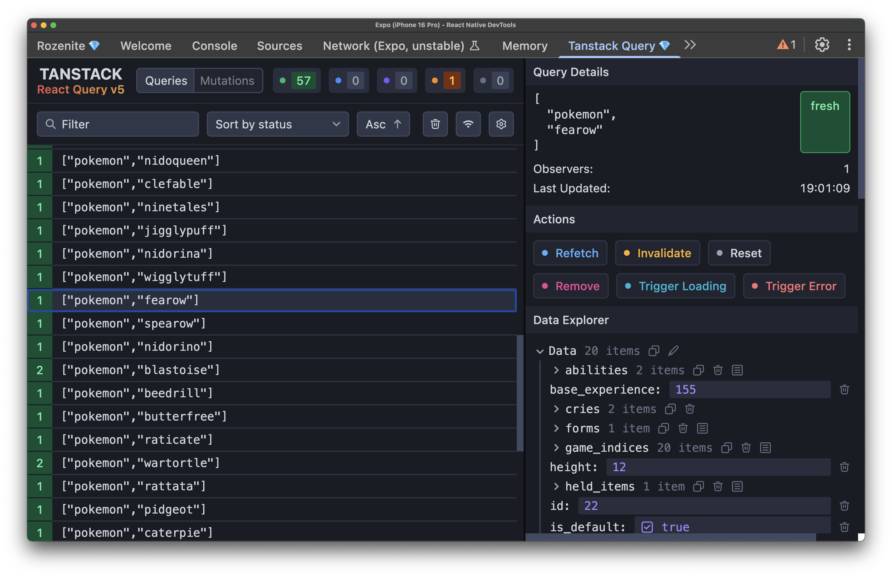
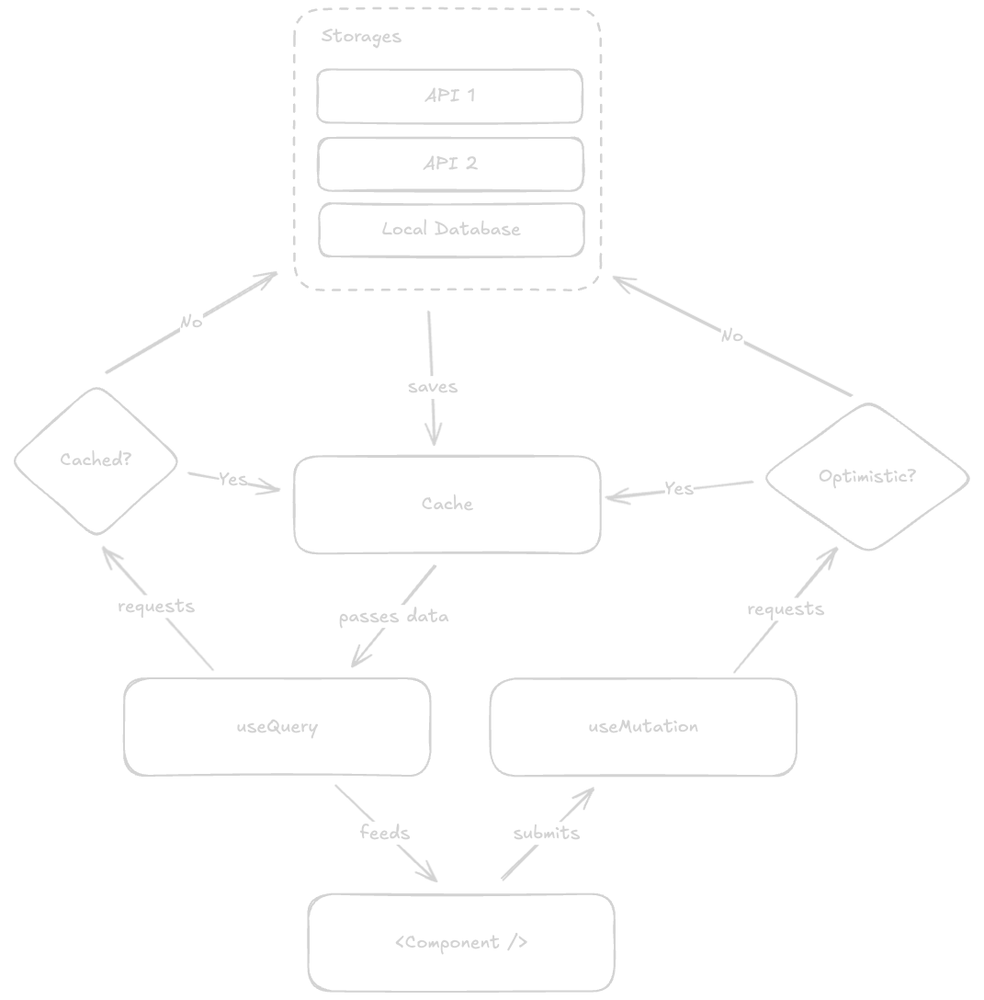

# Tanstack Query
## Getting the Pokédex Data

---

# Tanstack Query
## What does it solve?

- Data fetching
- Caching
- Synchronization
- ... and more



---



---

# Traditional React Fetching

```jsx
function PokemonList() {
  const [pokemon, setPokemon] = useState([]);
  const [loading, setLoading] = useState(true);
  const [error, setError] = useState(null);

  useEffect(() => {
    const fetchPokemon = async () => {
      try {
        setLoading(true);
        const response = await fetch('https://pokeapi.co/api/v2/pokemon?limit=20');
        const data = await response.json();
        setPokemon(data.results);
      } catch (err) {
        setError(err.message);
      } finally {
        setLoading(false);
      }
    };

    fetchPokemon();
  }, []);
}
```

---

# With TanStack Query

```jsx
import { useQuery } from '@tanstack/react-query';

function PokemonList() {
  const { data: pokemon, isLoading, error } = useQuery({
    queryKey: ['pokemon'], // cache identifier
    queryFn: () => 
      fetch('https://pokeapi.co/api/v2/pokemon?limit=20')
        .then(res => res.json())
        .then(data => data.results)
  });
```

---



---

# Query anything

```jsx
useQuery({
  queryKey: ['pokemon', pokemonId],
  // fetching something from the server
  queryFn: () => someApiService.getPokemonDetails(pokemonId),
});
useQuery({
  queryKey: ['favorites'],
  // fetching something from local storage
  queryFn: () => someLocalStorage.getFavorites(),
});
```

---


